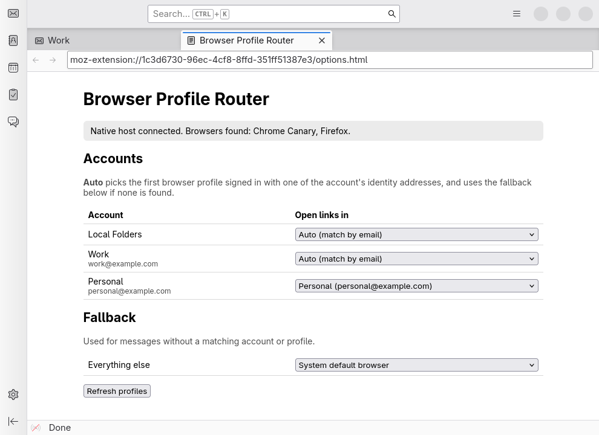
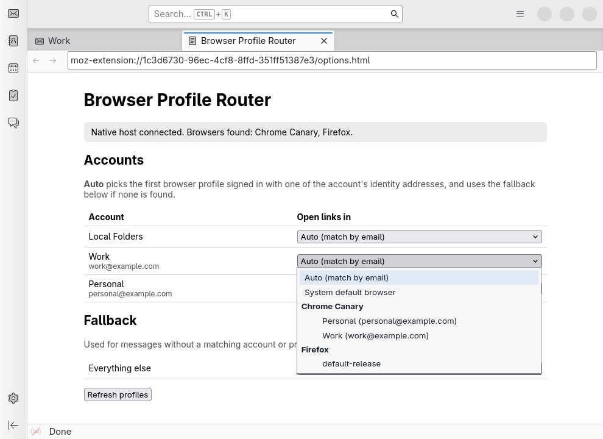

# Browser Profile Router

A Thunderbird add-on that opens links from a message in the browser profile
that matches the message's email account. For example, links in mail to
`me@work.com` open in the Chrome profile signed in as `me@work.com`, and
links in mail to `me@gmail.com` open in your personal profile.

**Get it from [addons.thunderbird.net](https://addons.thunderbird.net/thunderbird/addon/browser-profile-router/)**, then install the helper
(see [Install](#install-linux--macos)).





## How it works

- **`extension/`** is the Thunderbird MailExtension (Manifest V3, Thunderbird 128 or later).
  - `link-interceptor.js` is injected into every displayed message. It
    captures left and middle clicks on `http(s)` links and hands them to the
    background script.
  - `background.js` looks up the displayed message's account and picks a
    target (see below). It then asks the native host to launch the browser.
    If the host fails, it falls back to `windows.openDefaultBrowser`.
  - Right-clicking a link also offers **Open Link in Matching Browser Profile**.
  - It also tracks the selected message. Whenever the resolved target changes,
    it asks the host to save it to a context file
    (`$XDG_RUNTIME_DIR/browser-profile-router/context.json`).
- **`host/profile_router_host.py`** is a native messaging host. It finds the
  installed browsers, reads their profiles, and launches the right one.
  - Chromium-family browsers (Chrome Canary/Stable/Beta/Dev, Chromium, Brave,
    Edge, Vivaldi): profiles come from `Local State`, including the signed-in
    Google account email. The host launches `--profile-directory=<dir> <url>`.
  - Firefox and LibreWolf: profiles come from `profiles.ini`. The host
    launches `-P <name> --new-tab <url>`.
- **`host/thunderbird_url_handler.py`** is optional. It is registered as
  Thunderbird's own handler for http/https links and opens them using the
  saved context. It catches links the content script can't see, such as clicks
  in Thunderbird Conversations, which calls `windows.openDefaultBrowser` itself.
  It only changes how Thunderbird opens links; your system default browser
  stays the same.

### Picking the target

For each account you choose a target in the add-on's options:

| Setting | Behaviour |
|---|---|
| **Auto** (default) | Uses the first browser profile signed in with one of the account's identity addresses. Browsers are tried in the order listed above, so Canary comes first. |
| **System default browser** | Thunderbird's normal behaviour. |
| A specific profile | Always uses that profile. |

The **Fallback** setting covers anything else: accounts with no match, and
messages that don't belong to an account. When a message has no account
(an opened `.eml` file, Local Folders), the add-on tries to match its
recipients against your identities.

## Install (Linux / macOS)

```sh
./install.sh
```

This registers the native helper for Thunderbird, which the add-on needs to
launch browsers. It writes
`browser_profile_router.json` to `~/.mozilla/native-messaging-hosts/` and
`~/.thunderbird/native-messaging-hosts/` (on macOS, the `Library/…Mozilla/NativeMessagingHosts`
directories). It also builds `browser-profile-router.xpi`.

Next:

1. Restart Thunderbird.
2. Install the add-on from [addons.thunderbird.net](https://addons.thunderbird.net/thunderbird/addon/browser-profile-router/), which also keeps
   it updated. To use your own build instead, go to **Add-ons and Themes → ⚙ →
   Install Add-on From File…** and pick `browser-profile-router.xpi`.
3. Open the add-on's options and check that it reports "Native host connected".

### Thunderbird Conversations (and other add-ons that open links themselves)

This is opt-in because it changes a Thunderbird setting. Quit Thunderbird, then
run either:

```sh
./install.sh --link-handler           # helper + link handler
host/register_handler.py              # link handler only, all profiles in ~/.thunderbird
host/register_handler.py --uninstall  # undo
```

This sets the http/https entries in each profile's `handlers.json` to
`thunderbird_url_handler.py`, keeping a backup in `handlers.json.bak`. Links
then open in the profile for the **most recently selected message**. If no
context has been saved yet, they open in the system browser.

For development, load `extension/manifest.json` from
**Tools → Developer Tools → Debug Add-ons → Load Temporary Add-on** instead.
After editing files, click **Reload**.

The host manifest records the absolute path to `host/profile_router_host.py`.
If you move the repository, re-run `install.sh`.

### Windows (untested)

1. Write the host manifest somewhere, for example next to the script. Point
   `path` at a `.bat` wrapper that runs `python profile_router_host.py`.
2. Register the manifest under
   `HKCU\Software\Mozilla\NativeMessagingHosts\browser_profile_router`.

The host already knows the Windows install locations of the supported browsers.

## Testing

`tests/e2e/run.sh <thunderbird-install-dir>` runs an end-to-end test against
any Thunderbird build, for example `/usr/lib/thunderbird` or an unpacked
release tarball from archive.mozilla.org. Thunderbird runs headless inside a
[bubblewrap](https://github.com/containers/bubblewrap) sandbox with a fresh
profile, two test accounts, an empty `$HOME`, no network and no access to your
home directory. A fake `google-chrome-canary` records launches instead of
opening a browser. The test covers both link paths: a click in a message tab,
and `windows.openDefaultBrowser` from another add-on going through the URL
handler.

It passes on Thunderbird 128.0esr (the minimum version), 140.17.0esr and 156.0.

## Limitations

- Without `register_handler.py`, only links in the standard message reader
  are routed. With it, links from add-ons like Conversations use the selected
  message's account. If you open a conversation in its own tab and then select
  a message from another account elsewhere, the second account wins.
- The URL handler has only been tested on Linux.
- Auto-matching needs the profile's signed-in account email, which only
  Chromium-family browsers record. For Firefox profiles, set the mapping by hand.
- The host only opens `http`/`https` URLs, and only for profiles it found
  on disk.

## Privacy

Nothing leaves your computer. See [PRIVACY.md](PRIVACY.md) for exactly what is
exchanged with the native helper.

## License

[Mozilla Public License 2.0](LICENSE).
